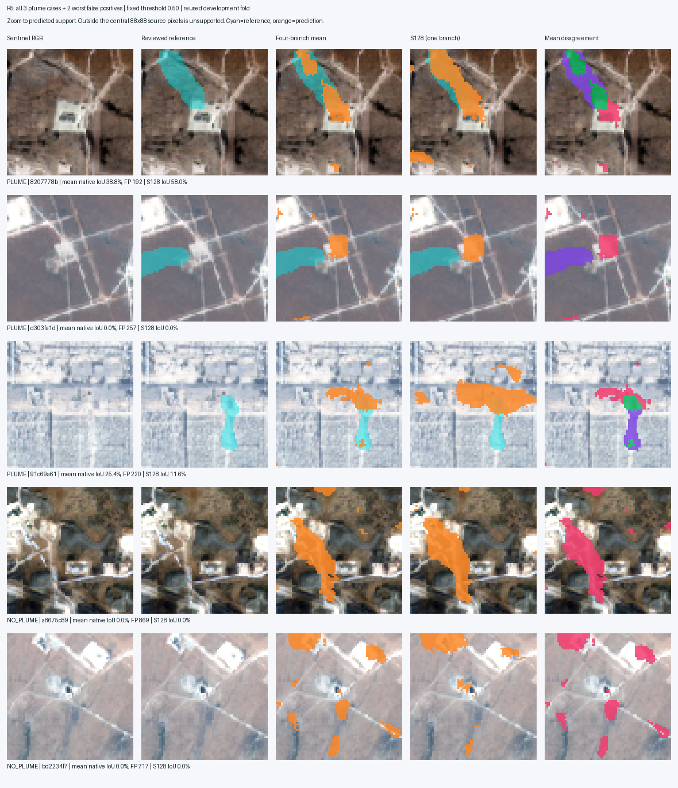

# Model6 follow-up: real pipeline faults, visible predictions, failed quality gate

The corrected mapper produces localized masks on real Sentinel inputs, but it still does not reliably identify methane plumes. Its primary four-branch mean has **2.1485% pooled IoU, 2.2487% precision and 32.5182% recall** on the reused development fold. The simple spectral baseline has 1.697% IoU on exactly the same support. This small development comparison is not confirmation of useful performance. No checkpoint is promoted and no nationwide scan is justified.

## What was actually wrong

1. **Positive sampling could return background.** In a seeded reconstruction of the old 800 training draws, 56 of 186 requested-positive draws lost their plume when a chosen center was clamped to fit S128 context. The corrected sampler chooses eligible centers after applying a shared full-scene transform and checks that positive targets survive. It draws one positive and one reviewed-negative tile per two-example batch. [Original sampler audit](../experiments/GTM_Model6_mapper_r4_sampling_audit.json).
2. **Export scoring used the wrong support.** All 65 r4 viewer scenes used full source QA support for native metrics while saved evaluation used actual context coverage. Recomputing from the original NPZs reproduces the frozen r4 evaluation exactly. The r4 predictions really are all-negative; a display bug did not hide good predictions. The corrected r4 export preserves the same checkpoint and predictions. [Audit](assets/GTM_Model6_20260922/r4_audit.md).
3. **Context and branch descriptions were misleading.** A 128-pixel context around a 16-pixel output leaves a **56-pixel margin**, not 64 or 128. On these 200×200 files only the central 88×88 pixels are predicted. R5 branch exports are now named separately and describe the displayed branch. The frozen report headline always describes the predeclared mean.
4. **The viewer did not resolve a probability-image asset field.** The server now validates and resolves that field. Interactive heatmaps already used the exported numeric grid; this asset omission did not explain the trained r4 collapse.

These are implementation and reporting faults that should have been caught earlier. Data scarcity is not an adequate explanation for them. R5 also lowers the learning rate to 0.0003 and removes fused-loss gradients, so this follow-up does not isolate which change caused the recovery from all-negative output.

## Bounded experiments and exact scope

Before R5, a training-only diagnostic fit four real 16×16 target tiles from training parents: two plume boundary tiles and two reviewed-negative tiles. All four branches memorized them (training IoU 1.0, zero negative activation) in 300 steps, about 13.4 seconds. This establishes optimizer/target learnability on those examples only. The separate viewer explicitly says **TRAINING FIT ONLY**. [Receipt](assets/GTM_Model6_20260922/training_sanity_receipt.json).

R5 then fit 99 MARS parents and evaluated 65 excluded-from-fit parents: three reviewed plumes and 62 reviewed-negative controls. This is the same development fold examined before; it is not a new test set. The run used 400 steps, seed 20260922, batch size two, fixed threshold 0.50 and a three-minute cap; actual training/inference runtime was about 38.1 seconds. The primary mean and threshold were declared before this run. There were 400 positive draws among 800 draws, with 35,099 positive supervised pixels. All eight Martin transforms remain training-only.

The four independent S16/S32/S64/S128 branches receive the **first 16 Sentinel-only features** from each stored tensor. Stored channel 17 is an analytic Sentinel spectral evidence plane used only for the baseline in this run; it is not a model input. R5 minimizes the mean of the four separate branch losses with fused-loss weight zero. The merger averages branch logits, applies sigmoid per output tile, and averages probabilities where tiles overlap. There is no learned merger. The crop-coordinate prior baseline averages training-parent masks at matching crop coordinates; it is not a geographic facility prior.

The enhancement head is disabled. MARS masks, not quantitative EMIT targets, supervise this run. Thus the result does not test quantitative EMIT reconstruction/upscaling, emission-origin accuracy, CAFO recovery or nationwide screening.

| Method | Pooled IoU | Precision | Recall | Background pixels flagged |
|---|---:|---:|---:|---:|
| Four-branch mean, primary | 2.1485% | 2.2487% | 32.5182% | 4.2643% |
| S16 | 0.517% | 0.551% | 7.733% | 4.214% |
| S32 | 1.206% | 1.238% | 31.923% | 7.683% |
| S64 | 1.622% | 1.673% | 34.765% | 6.165% |
| S128 | 1.549% | 1.575% | 47.852% | 9.019% |
| Spectral baseline | 1.697% | 1.941% | 11.897% | 1.813% |
| All-positive | 0.301% | 0.301% | 100% | 100% |
| All-negative / crop-coordinate prior | 0% | 0% | 0% | 0% |

The primary counts are TP 492, FP 21,387, FN 1,021 and TN 480,144 across **503,044 supported native pixels**. Background activation is a pixel fraction, not a scene false-positive rate or national prevalence. This cropped, one-fold result cannot be ranked directly against the earlier full-scene, five-fold 1.33% and 2.67% pilots.

Checkpoint SHA-256: `39f2ca29688f90394cbe78c4521d158968f1901e3c1255e88900cac8457eccc4`.

[Frozen run report](assets/GTM_Model6_20260922/r5_report.md) · [Predeclared protocol](assets/GTM_Model6_20260922/r5_protocol.json).

## Visual decision

Reviewed **all three plume scenes and the two largest false-positive controls**. The original arrays reproduce the native and exported confusion counts for all 65 scenes × five methods (325 comparisons). The review sheet zooms to the actual 88×88 prediction support using nearest display resampling. Cyan is reference, orange is prediction; disagreement colors show overlap, misses and extra predictions.

- `8207778b`: mean IoU 38.8%; the selected S128 example reaches 58.0%. The predicted feature partly follows the labeled plume, but extends onto the facility and nearby background. These are selected-case scores, not overall performance.
- `d303fa1d`: the mean misses the plume and activates the adjacent bright facility. IoU 0%.
- `91c69a61`: the mean overlaps part of the plume (25.4% IoU) while activating a crosswise feature over the industrial background.
- Reviewed-negative `a8675c89` and `bd2234f7`: large detections follow surface structures despite no labeled plume. These failures rule out promotion.

[Review receipt](assets/GTM_Model6_20260922/r5_visual_review.json) · [Open selected mean example](http://127.0.0.1:8766/?experiment=GTM_Model6_mapper_mars_pilot_20260922_r5_mean&scene=MARS_2c6ef011-0729-42e2-b64f-10ff8207778b#compare) · [Same viewer over Tailscale](https://desktop-v07a1pi.tail948ef9.ts.net:8766/?experiment=GTM_Model6_mapper_mars_pilot_20260922_r5_mean&scene=MARS_2c6ef011-0729-42e2-b64f-10ff8207778b#compare). All 65 cases and all four branches are selectable. The viewer shows run-wide failure scores next to selected-case scores, and frozen native scores separately from interactive display scores; changing the display threshold does not change the frozen result. Original r2/r3/r4 bundles are archived, with label changes backed up in a [metadata receipt](assets/GTM_Model6_20260922/viewer_metadata_receipt.json) and a separate [aggregate-display receipt](assets/GTM_Model6_20260922/viewer_aggregate_receipt.json).

## Native EMIT data: the next repair is concrete

The corrected [native pairing audit v3](assets/GTM_Model6_20260922/native_pair_readiness.md) uses existing files only. It verifies all six cached Sentinel stack/mask hashes and checks the ENH/SENS/UNCERT CRS, affine, shape and bounded-window alignment before combining finite/nodata support. PLM is evaluated in its own grid with a transformed footprint. Metadata units are ENH and UNCERT `ppm m`, SENS `unitless`; no sensitivity cutoff is invented. Finite overlap alone is not an approved quality mask.

| Native acquisition | Cached Sentinel timing | Native maximum covered? | Strict pairing result |
|---|---|---|---|
| Georgia, 2024-10-20 | −0.517 h; fallback +119.479 h | Neither crop | Closest-time crop misses peak |
| Texas, 2024-11-30 | −240.297 h / +239.703 h | Neither crop | Timing and coverage fail |
| Texas, 2025-09-22 | −27.071 h / +20.759 h | Both crops | Timing fails |

**Zero of six** satisfies both the declared ±6-hour engineering rule and peak containment. The six-hour rule is a pairing policy, not evidence that a plume vanished after six hours. Peak containment is a source-review/context gate, not a requirement that every partial-plume segmentation crop must contain the maximum. Partial and lagged observations can be diagnostic with explicit limitations; they cannot silently become strict paired examples. In particular, the 2025 peak is covered: earlier blanket wording that all six crops miss peaks was wrong. The maximum is not a verified emission origin.

A targeted local search found no larger matching Sentinel raster in the inspected caches. The prepared plan was followed by an actual bounded [header probe](assets/GTM_Model6_20260922/georgia_probe.json) of the exact close-time Sentinel scene. It confirmed coverage and native band metadata. The proposed 5.12 km crop needed 14 MiB of additional blocks, exceeding the new helper's 12 MiB attempt limit. A **2.56 km peak-centered crop** fit a conservative 7.5 MiB estimate from already-cached headers, so that smaller diagnostic crop was acquired after SCL quality checking.

The [acquisition receipt](assets/GTM_Model6_20260922/georgia_acquisition.json) records all five bands plus SCL, their native 10/20 m grids, reflectance scales/offsets, crop bounds and hashes. The peak is (34.27989, −84.36325). Raster transfer was 7,864,320 bytes; header/metadata transfer was 1,594,322 bytes. Total received in this repair was **9,458,642 bytes (9.02 MiB)**. Conservative cumulative charges are now 42,467,328 / 104,857,600 bytes (40.5 / 100 MiB), leaving 59.5 MiB. No budget was reset or enlarged; the larger crop was not downloaded.

This acquisition removes the known peak-coverage defect for one near-time target crop. It does not prove full-plume containment or establish an independent training cohort. No new training follows merely from this one successful transfer.

The completed [local QA v2](assets/GTM_Model6_20260922/georgia_qa.md) verifies every acquired hash, native 10/20 m grid and exact footprint. Native ENH/SENS/UNCERT share **2,166 / 2,180 geometry pixels (99.36%)** after finite/nodata checks. The measured enhancement maximum is within **0.341 m** of the published maximum coordinate. These checks establish spatial coverage; finite values are not a complete scientific quality mask.

Two further pitfalls were caught in the draft QA and corrected before using it:

- **Continuous EMIT values were being mistaken for a binary plume mask.** In this window CH4PLM equals CH4ENH on common support, with values from −1,463 to 22,890 ppm m. 2,088 of 2,166 valid pixels are positive; `PLM > 0` would label 96.4% of valid pixels. No binary plume label is derived from this threshold. NASA documents enhancement as continuous values and a separate vector plume outline in the GeoJSON product. The actual CH4PLMMETA product is absent from the inspected acquisition directory. A separately cached `.plume.geojson` does exist and matches its recorded hash (`e82031398ad9e1969d8900b8b99f8040494b3ddd14d811ce32b862bd6a3dcf6b`), but its manifest explicitly identifies the source as CMR UMM SpatialExtent. Do not silently substitute that catalog geometry for the unverified product outline. The legacy masks cover the entire original Georgia crop (65,536/65,536 pixels), which cannot supervise internal plume detail. [NASA V2 user guide](https://lpdaac.usgs.gov/documents/2250/EMIT_L2B_GHG_User_Guide_V2.pdf).
- **Reflectance metadata can trigger a second offset.** The frozen legacy Sentinel item declares both `earthsearch:boa_offset_applied=true` and asset offset −0.1. Literal application makes most RGB pixels negative. Raw DN and original hashes are preserved; the copied scale/offset tags are not an approved quantitative conversion. The corrected figure uses a labeled raw-DN display stretch, never clipped pseudo-reflectance. Provider documentation describes different conventions for legacy and newer collections; reconcile this exact item before any temporal or quantitative training. [EarthSearch maintainer discussion](https://github.com/Element84/earth-search/discussions/26), [provider README](https://github.com/Element84/earth-search/blob/main/README.md).

The earlier draft `qa/` is explicitly invalidated and retained for traceability; use `qa_v2/`. It had rounded native windows, an unverified mask interpretation and misaligned display grids. The active native readiness tool also no longer treats positive-valued PLM pixels as a readiness gate. Historical v3 counts retain their descriptive meaning only. Remaining work is radiometry resolution, provider outline and target QA, a suitable Sentinel temporal reference, and independent positive/negative observations. These are concrete preparation tasks, not grounds to start another model sweep.

## Completion and limits

The training diagnostics reused existing imagery and stopped after one training-fit check and one development follow-up. A subsequent targeted crop repair transferred 9.02 MiB in total, under the existing cumulative cap. Historical checkpoints and predictions were preserved. No national inference, TESSERA experiment or source-head training occurred. The active code, design, journal and project memory distinguish completed engineering work from failed scientific gates. The previous-team checkpoint comparison remains separate and unexecuted in the selected environment because TensorFlow is absent.

Verification: 78 focused regression tests passed; the mapper export's 16 pipeline checks passed after adding aggregate metadata. A later offline 19-test raster suite passed, comprising five existing native-readiness tests, ten new acquisition checks and four new checks for offset conflicts, continuous PLM semantics, shifted grids and modified files. That is 92 distinct passing checks across these suites. Configuration validation, JavaScript syntax and whitespace checks passed. Browser review verified native/display scores, branch switching, false positives, training-only labels and unchanged frozen scores after moving the display threshold. Tailscale routed to the same local outputs with network settings unchanged.
