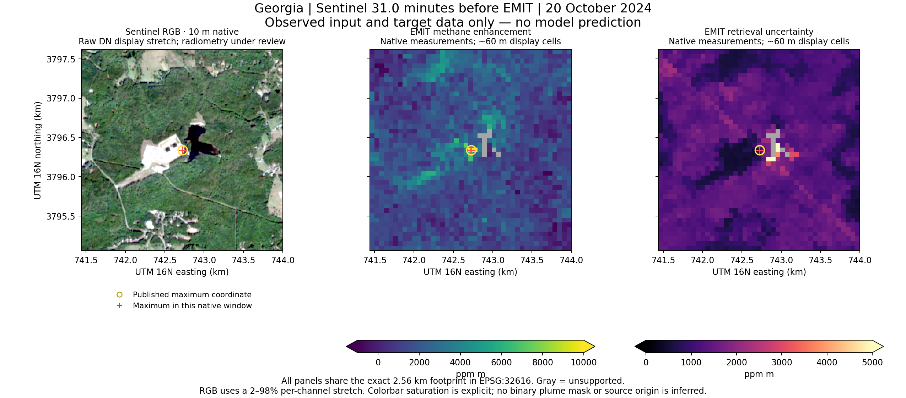

# Repaired Georgia pair: local QA v2

**Geometry verified; quantitative training not approved.** This is observed input/target data, not a prediction.

Sentinel precedes EMIT by 30.9968 minutes. The exact 2.56 km UTM footprint contains the published maximum coordinate. Native common support: 2166 / 2180 pixels; SCL clear fraction: 100.0%.

Every crop SHA matches the frozen acquisition receipt. ENH/SENS/UNCERT native CRS, full grid, window transform and geometry agree before combining support. Display reprojection is separate from native measurements.

CH4PLM is continuous enhancement in ppm m, with negative and positive values. PLM > 0 was not used as a plume outline, target, or quality mask. The acquisition peak is not a verified emission origin.

Sentinel STAC declares both earthsearch:boa_offset_applied=true and raster offset=-0.1. The raw DN is preserved; the literal tags are not an approved conversion. RGB uses raw DN percentiles solely for visibility. The prior double-offset/clipped RGB display is invalidated.

Provider context: [EarthSearch offset discussion](https://github.com/Element84/earth-search/discussions/26) and [current provider README](https://github.com/Element84/earth-search/blob/main/README.md). These do not by themselves reconcile this frozen legacy item's flags.

Next gates: Resolve already-applied BOA flag versus literal nonzero raster offset; Define native enhancement/uncertainty/sensitivity QA and target semantics; Acquire or identify a suitable Sentinel temporal reference; Independent grouped positive and reviewed-negative acquisitions.
